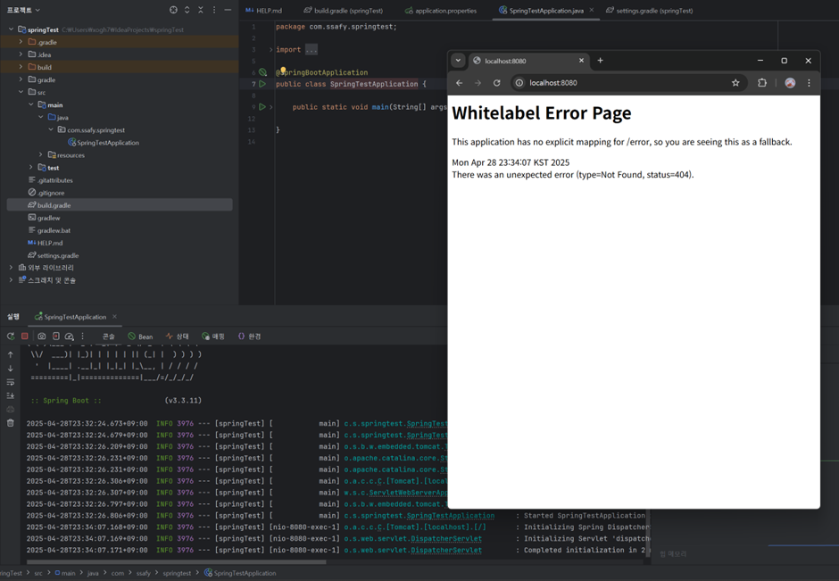

### 1. spring-tutorial 미션

#### 1) 서버 작동 확인하기


<br>

#### 2) Spring Boot 에서 제공하는 Bean 확인하기


- dispatcherServlet
- ViewResolver
- handler 등등 수업시간에 들어본 것들이 적혀있네

<br>

#### 3) 실행되는지 확인하기


<br>

#### 4) 단위테스트 실행하기


<br>

#### 5) 서버 실행 후, API 요청을 보내 200 확인하기


<br>
<hr>
<br>

### 2. Spring이 지원하는 기술
#### Spring 특징
: POJO 기반의 DI, AOP, PSA

> POJO ( Plain Old Java Object )
: 자바 언어 규약에 의한 제한사항 외의 <b>그 어떤한 제한사항에도 구속받지 않는 ( 의존성을 최소화한 ) 자바 객체 <b>

POJO = 아무것도 상속도 안받고, 싱글톤도 안하고 그냥 순수한 자바 파일

<br>

- DI ( Dependency Injection : 의존성 주입 )
- AOP ( Aspect Oriented Programming : 관점 지향 프로그래밍 )
- PSA ( Portable Service Abstraction : 이식 가능한 서비스 추상화 )


<br>

#### 1. DI ( 의존성 주입 )
: 객체가 의존하는 또 다른 객체를 외부에서 선언하고 이를 주입받아 사용하는 것
= 외부에서 객체를 주입받아 사용하는 것

<br>

기존 방식
```
// 클래스 A에서 new 키워드로 클래스 B의 객체 생성

public class A{
	b = new B();       
}
```

스프링 사용 방식
```
// 객체를 주입 받기

public class A{
	// A에서 B를 주입받는다
    @Autowired
    B b;
}
```
<br>
> IoC ( Inversion of Control )

- 제어의 역전
- 객체의 생성과 관리를 개발자가 하는 것이 아니라 프레임워크 ( Spring ) 가 대신하는 것


<br>

#### 2. AOP ( Aspect Oriented Programming )
: 기능을 비즈니스 로직이 아니라 필요한 개별 관점으로 본다.
= 횡단 관심을 모듈화해서 필요한 곳에 적용한다.


<br>

#### AOP를 왜 써야해?
- 횡단 관심사는 여러 메서드를 가로지르며 등장하는 부가 로직
ex) 로깅, 성능, 보안, 암호화, 예외처리, 트랜잭션 처리 등

- 부가 로직이 많아지면 유지 보수가 어렵다

- 개발자는 핵심 관심에 집중하고 싶다

<br>

#### 사용 용어
- target : AOP가 적용될 대상
- aspect : 하나 이상의 advice
- advice : 횡단 관심 코드를 모듈화 한 메서드
- join point : advice가 동작하는 지점
- pointcut : advice를 적용할 대상을 결정하는 표현식


<br>

#### 3. PSA ( Portable Service Abstraction)
: 환경의 변화와 관계없이 일정한 방식의 기술로의 접근 환경을 제공하는 추상화 구조

<br>

#### PSA 왜 써야해?
ex) 만약 트랜잭션 코드를 짜야한다

기존 방식
```
Connection conn = null;
try {
    conn = dataSource.getConnection();
    conn.setAutoCommit(false); // 트랜잭션 시작

    // DB 작업
    // ...

    conn.commit(); // 성공 시 커밋
} catch (Exception e) {
    if (conn != null) {
        conn.rollback(); // 실패 시 롤백
    }
} finally {
    if (conn != null) {
        conn.close();
    }
}

```

<br>
스프링 PSA를 사용한다면?

```
import org.springframework.stereotype.Service;
import org.springframework.transaction.annotation.Transactional;

@Service
public class UserService {

    @Transactional
    public void createUser(User user) {
        // 이 메서드 안에서 예외가 발생하면 자동으로 롤백
        // 정상 수행되면 자동으로 커밋
        userRepository.save(user);
    }
}

```

- 개발자는 트랜잭션을 시작/커밋/롤백 하는 세부 로직을 몰라도 되고

- JDBC, JPA 등 어떤 걸 쓰든 일관되게 처리해준다!


<br>
<hr>
<br>


#### 3. Spring Bean
: 스프링 프레임워크에 의해 생성되고 관리되는 자바 객체

- 스프링 컨테이너에 의해 관리되는 재사용 가능한 소프트웨어 컴포넌트

- 스프링은 빈의 생성, 의존 관계 설정, 객체 관리 등 빈의 라이프 사이클을 관리

<br>

#### 의존성 주입 ( DI ) 방법
1. 생성자 주입 : 주로 사용
2. Setter 주입
3. Field 주입

<br>

#### 사용 예시
MyService를 스프링 컨테이너에 등록
```
@Component
public class MyService{
    . . .
}
```

1. 생성자 주입
```
public class MyController{
	
    private final MyService mService;
    
    // 생성자를 통해 의존성 주입
    public MyController ( MyService mService ) {
    	this.mService = mService;
    }
	
}
```

추가로 생성자도 @RequiredArgsConstructor로 만들자

```
@Controller
@RequiredArgsConstructor
public class MyController{
	
    private final MyService mService;
    
}
```

<br>

2. Setter 주입

```
public class MyController {

    private MyService myService;

    @Autowired
    public void setMyService(MyService myService) {
        this.myService = myService;
    }
}
```
<br>

3. 필드 주입
```
public class MyController {

    @Autowired
    private MyService myService;
}

```

<br>
<hr>
<br>

#### 스프링 어노테이션
: 자바에서 코드 사이에 특별한 의미, 기능을 수행하도록 하는 기술

- 프로그램에 관한 데이터를 제공
- 코드에 정보를 추가

<br>

#### @Bean
: 이 메서드는 bean 입니다 라고 명시적 DI

<br>

#### Component
: 이 클래스는 곧 bean이 될 겁니다 라고 묵시적 DI

그럼 언제 bean이 되냐?
- @ComponentScan 이 실행될 때

> 클래스 특징에 따라 @Controller, @Service, @Repository 라고 적어주자

<br>

@Autowired
: 빈을 주입하기 위해 사용

<br>


#### @SpringBootApplication
: SpringBoot 애플리케이션의 시작점인 클래스에 선언하는 애너테이션

내부적으로 가지는 어노테이션
- @SpringBootConfiguration
- @EnableAutoConfiguration
- @ComponentScan

> 그래서 SpringApplication.java 를 실행하면 알아서 ComponentScan을 하는구나!

>이전 까지는 Config.java 를 만들어서 @Configuration 이라 적어두고 , @ComponentScan 을 했는데
@SpringBootApplication 애너테이션 안에 이 모든게 다 들어가있다!

<br>
<hr>
<br>

#### 5. 단위 테스트 & 통합 테스트

단위테스트 ( Unit Test )
: 메서드 하나, 클래스 하나 를 독립적으로 테스트

- 테스트 범위가 작으므로 속도가 빠르고 틀린 부분을 빠르게 알아낼 수 있다.

```
class OrderServiceTest {

    private OrderService orderService = new OrderService();

    @Test
    void testCalculatePrice() {
        int price = orderService.calculatePrice(10000, 10); // 10% 할인
        assertEquals(9000, price); // 결과가 9000
    }
}

```


<br>

통합 테스트 ( Integration Test )
: 여러 컴포넌트를 함께 묶어서 테스트

- 테스트 범위가 크고, 실제 의존성을 사용하여 컴포넌트들이 잘 연동되는지 확인할 수 있다

- 하지만 어디서 실패했는지 찾는데 시간이 오래 걸린다.


```
@SpringBootTest
class MemberIntegrationTest {

    @Autowired
    private MemberService memberService;

    @Test
    void testSignUp() {
        // 회원 가입
        Member member = new Member();
        member.setName("testuser");
        Long savedId = memberService.signUp(member);

        // 저장된 회원 찾기
        Member findMember = memberService.findOne(savedId).get();

        assertThat(findMember.getName()).isEqualTo("testuser");
    }
}
```

- 컨트롤러 -> 서비스 -> DB 까지 잘 연결되는지 전체 검증